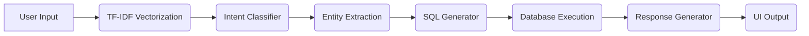

# 🤖 QueryGenie

### Offline NLP-Powered Text-to-SQL Engine (NLIDB)

> 🧠 Built as a **6th Semester NLP Project** using classical Natural Language Processing techniques in Python.
>
> Transform natural language into executable SQL — fully offline, privacy-first, and zero API cost.

---

---

## 🎓 Academic Context

QueryGenie was developed as part of a **6th Semester Natural Language Processing project**, with a strong focus on implementing **core NLP concepts from scratch using Python** rather than relying on large language models.

This project emphasizes:

* Practical application of NLP pipelines
* Classical ML over black-box APIs
* Explainability and transparency in language understanding

---

## 🚀 Overview

**QueryGenie** is a Natural Language Interface to Database (NLIDB) that enables users to query structured databases using plain English or voice.

Unlike LLM-based systems, it is built entirely using:

* 🐍 **Python-based NLP pipeline**
* 🧠 **Classical Machine Learning (scikit-learn)**
* 🧩 **Rule-based linguistic processing**

This makes the system:

* 🔒 Fully offline
* 💸 Zero-cost
* ⚡ Lightweight and fast
* 🛡️ Privacy-preserving

---

## ✨ Features

### 🧠 Natural Language → SQL

```text
"Show students who scored more than 80"
```

```sql
SELECT * FROM STUDENT WHERE MARKS > 80;
```

---

### 🔐 100% Offline & Private

* No APIs, no cloud
* Runs locally
* Suitable for secure environments

---

### 🎯 NLP-Driven Understanding

* Intent Classification
* Entity Extraction
* Semantic Similarity Matching

---

### 📊 Explainable UI (Streamlit)

* Query results visualization
* Debug panel with:

  * Intent + confidence
  * Extracted entities
  * Generated SQL

---

### 🎤 Voice Input

* Speech-to-text query support

---

## 🧠 NLP Modules Covered

This project demonstrates key NLP concepts typically covered in a semester course:

### 1. Text Preprocessing

* Tokenization
* Lowercasing
* Stopword handling (implicit via TF-IDF)

### 2. Feature Extraction

* **TF-IDF Vectorization**
* Converts text into numerical feature space

### 3. Intent Classification

* **Logistic Regression (Supervised Learning)**
* Maps user queries to predefined intents

### 4. Semantic Similarity

* **Cosine Similarity**
* Handles ambiguous or unseen queries

### 5. Entity Extraction (Slot Filling)

* **Regex-based pattern matching**
* Extracts:

  * Numerical values (e.g., 80)
  * Conditions (>, <, =)
  * Limits (Top N queries)

### 6. Template-Based Language Understanding

* Maps structured intent + entities → SQL templates

### 7. Natural Language Generation (NLG)

* Converts SQL results into readable responses

---

## 🧩 System Architecture



---

## 🛠️ Tech Stack

### 🧠 NLP Stack (Core Intelligence)

| Component             | Technology                                      | Purpose                                           |
| --------------------- | ----------------------------------------------- | ------------------------------------------------- |
| Text Vectorization    | TF-IDF                                          | Converts natural language into numerical features |
| Similarity Engine     | Cosine Similarity                               | Handles ambiguous queries via semantic matching   |
| Intent Classification | Logistic Regression (scikit-learn)              | Predicts user intent from query                   |
| Entity Extraction     | Regex (re)                                      | Extracts conditions, values, and limits           |
| NLP Pipeline          | Tokenization, Feature Engineering, Slot Filling | End-to-end language understanding workflow        |
| Response Generation   | Rule-based NLG                                  | Converts SQL output into readable responses       |

---

### ⚙️ System Stack (Execution Layer)

| Component     | Technology             | Purpose                                |
| ------------- | ---------------------- | -------------------------------------- |
| Language      | Python 3               | Core implementation language           |
| Backend Logic | Modular Python Scripts | Handles pipeline orchestration         |
| UI Framework  | Streamlit              | Interactive frontend + debug interface |
| Database      | SQLite3                | Local query execution engine           |
| Data Handling | Pandas                 | Data processing and formatting         |
| Voice Input   | SpeechRecognition      | Converts speech to text                |
| Security      | Template-based SQL     | Prevents SQL injection                 |

---

## 📂 Project Structure

```bash
QueryGenie/
│
├── app.py
├── intent_classifier.py
├── entity_extractor.py
├── sql_generator.py
├── response_generator.py
├── speech_handler.py
├── sql.py
├── student.db
├── requirements.txt
└── README.md
```

---

## ⚙️ Setup & Installation

```bash
git clone https://github.com/gee-46/querygenie.git
cd querygenie
python -m venv venv
```

Activate:

```bash
venv\Scripts\activate   # Windows
source venv/bin/activate # macOS/Linux
```

```bash
pip install -r requirements.txt
python sql.py
streamlit run app.py
```

---

## 💡 Example Queries

* "Show all students"
* "How many students are there?"
* "Top 3 performers"
* "Average marks"
* "Students scoring above 80"

---

## 🎯 Use Cases

* 🎓 Academic NLP demonstrations
* 📊 Database querying without SQL knowledge
* 🔐 Offline enterprise tools
* 🧠 Learning end-to-end NLP pipelines

---

## ⚠️ Limitations

* Single-table schema
* Limited intent set
* No advanced NER (yet)

---

## 🚀 Future Improvements

* spaCy-based Named Entity Recognition
* Multi-table JOIN support
* Offline speech models (Whisper/Vosk)
* Data visualization

---

## 👨‍💻 Author

**Gautam N Chipkar**
GitHub: [https://github.com/gee-46](https://github.com/gee-46)

---

## ⭐ Support

* Star ⭐
* Fork 🍴
* Build 🚀

---

## 📜 License

MIT License

---

## 💎 Core Idea

> This project proves that **powerful NLP systems can be built using Python and classical techniques** — without relying on expensive APIs or large models.

**Explainable. Offline. Academic. Practical.**
